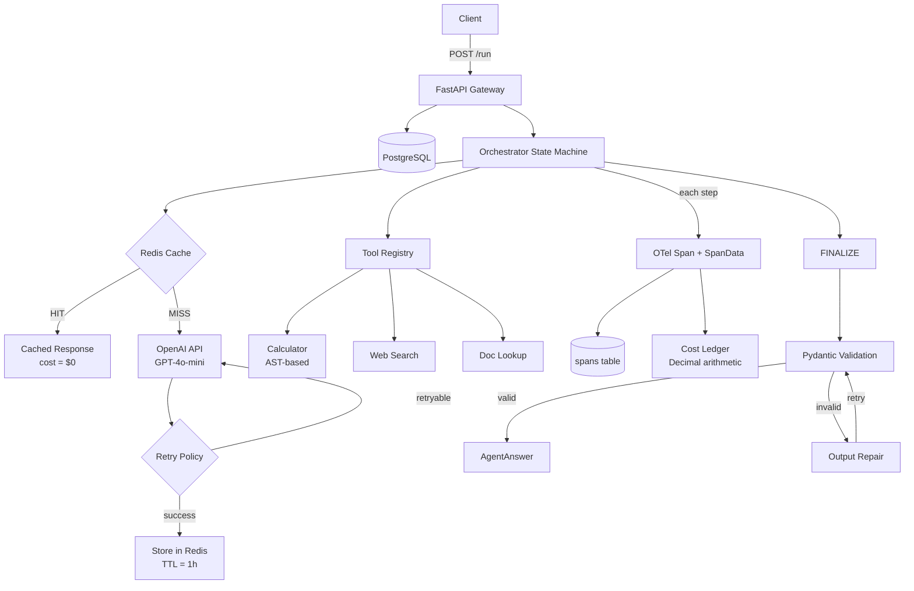

# Agent Platform

Infrastructure platform for a multi-step LLM research agent — making every run observable, measurable, and reproducible.

The agent receives a question, plans a strategy, calls tools (search, calculator, document lookup), and produces a structured, cited answer. The platform wraps this agent with production-grade infrastructure: per-step tracing, token/cost accounting, content-hash caching, and CI.

## Motivation

When you run an LLM agent, you get an answer but no visibility into what happened along the way — which tools it called, how many tokens each step burned, or why the cost spiked on one particular run. This project wraps that agent with infrastructure to answer those questions.

## Key Features

- **Explicit state machine orchestrator** — PLAN, SELECT_TOOL, CALL_TOOL, OBSERVE, FINALIZE states with typed transitions, replacing framework black-box loops with fully traceable control flow
- **Tool registry with Pydantic validation** — abstract `BaseTool` contract; tools define a Pydantic input model, get automatic input validation and OpenAI function schema generation
- **Per-step OpenTelemetry tracing** — every orchestrator state creates an OTel span with token counts, latency, cost, and cache status, persisted to Postgres for API-queryable traces
- **Token/cost accounting with Decimal arithmetic** — static pricing table, exact financial math from per-token prices through aggregation, no floating-point drift
- **Content-hash cache in Redis** — SHA-256 of (step_type + normalized input) as cache key; cache hits skip the LLM call entirely at zero cost; graceful degradation when Redis is unavailable
- **Retry with exponential backoff and error classification** — retryable errors (timeout, rate limit, 5xx) get exponential backoff; non-retryable errors (auth, validation) raise immediately
- **Structured output repair** — when the LLM returns invalid JSON, the Pydantic validation error is fed back to the model for a targeted retry

## Architecture



## Tech Stack

| Layer | Choice | Why |
|---|---|---|
| Language | Python 3.11+ | Async-native, strong typing, broad LLM ecosystem |
| API | FastAPI | Async-native, built-in Pydantic validation, auto OpenAPI docs |
| Database | PostgreSQL 16 | JSONB for flexible fields, relational integrity for runs/spans/evals |
| Cache | Redis 7 | TTL-based expiration, survives restarts, shared across instances |
| Tracing | OpenTelemetry SDK | Industry-standard spans with context propagation, backend-agnostic |
| LLM | GPT-4o-mini via OpenAI SDK | Lowest per-token cost (~$0.15/M input), mature function-calling API |
| Validation | Pydantic v2 | Type-safe schemas, automatic JSON Schema for tool definitions |
| DB driver | asyncpg | Fastest Python Postgres driver, raw SQL for full query visibility |
| Containers | Docker + Compose | Single `docker compose up` for the full stack |
| CI | GitHub Actions | Automated test suite on every push and PR |

## How It Works

### Agent Run Lifecycle

1. **Request** — `POST /run` with a question; a run record is created in Postgres
2. **Plan** — the orchestrator sends the question to GPT-4o-mini with available tool schemas
3. **Cache check** — before each LLM call, a SHA-256 content hash is checked against Redis; hits skip the API call at zero cost
4. **Tool loop** — if the model requests a tool, the orchestrator validates input via Pydantic, executes the tool, and sends results back to the model; this loop repeats until the model produces a final answer
5. **Finalize** — the model's text response is parsed as JSON and validated against the `AgentAnswer` schema; on validation failure, the error is fed back for a targeted repair attempt
6. **Trace** — every step records an OpenTelemetry span and a SpanData record with tokens, cost, latency, and cache status
7. **Persist** — spans are written to Postgres; total cost is accumulated on the run record
8. **Response** — the client receives the answer, full trace, and cost breakdown

## Project Structure

```
agent-platform/
├── src/
│   ├── main.py              # FastAPI app — POST /run, GET /runs/{id}, GET /runs/{id}/cost
│   ├── orchestrator.py      # State machine — plan, select, call, observe, finalize, repair
│   ├── cache.py             # Redis client — SHA-256 key gen, get/set with TTL
│   ├── pricing.py           # Static pricing table — Decimal per-token cost computation
│   ├── errors.py            # Error classification — retryable vs non-retryable
│   ├── models.py            # Pydantic schemas — AgentAnswer, SpanRecord, CostBreakdown
│   ├── db.py                # asyncpg pool — CRUD for runs and spans
│   ├── config.py            # Environment-based settings via pydantic-settings
│   └── tools/
│       ├── base.py          # BaseTool ABC — input validation, schema generation
│       ├── calculator.py    # AST-based safe math evaluator
│       ├── web_search.py    # Deterministic stub for eval reproducibility
│       └── doc_lookup.py    # Keyword search over local documents
├── db/
│   └── init.sql             # DDL for runs, spans, eval tables
├── tests/                   # Unit + integration tests (mocked LLM, DB, Redis)
├── scripts/                 # Verification and utility scripts
├── docs/                    # Architecture, decisions, tradeoffs
├── .github/
│   └── workflows/
│       └── ci.yml           # Automated test suite
├── docker-compose.yml       # Postgres 16, Redis 7, app
├── Dockerfile
└── requirements.txt
```

## API

### `POST /run`

Submit a question to the agent.

**Request:**
```json
{"question": "What is the population of France?"}
```

**Response:**
```json
{
  "run_id": "550e8400-e29b-41d4-a716-446655440000",
  "status": "completed",
  "question": "What is the population of France?",
  "answer": {
    "answer": "The population of metropolitan France is approximately 68.4 million as of January 2024.",
    "citations": [
      {"source": "Demographics of France - Wikipedia", "text": "The population of metropolitan France was estimated at 68.4 million as of January 2024."}
    ],
    "confidence": 0.92
  },
  "total_cost_usd": "0.000045",
  "spans": [
    {
      "step_type": "plan",
      "tokens_in": 450,
      "tokens_out": 38,
      "cost_usd": "0.000090",
      "cache_hit": false,
      "latency_ms": 520.3
    }
  ]
}
```

### `GET /runs/{run_id}`

Retrieve a completed run with its full trace.

### `GET /runs/{run_id}/cost`

Get the cost breakdown for a run — total cost, aggregate tokens, and per-span detail.

### `GET /health`

Liveness check.

## Database Schema

```sql
-- Agent run records
runs (
    id              UUID PRIMARY KEY,
    created_at      TIMESTAMPTZ,
    input_question  TEXT,
    final_answer    JSONB,          -- AgentAnswer as JSON
    status          TEXT,           -- pending | running | completed | failed
    error_message   TEXT,
    total_cost_usd  NUMERIC(10,6)  -- accumulated from span costs
)

-- Per-step trace records
spans (
    id          UUID PRIMARY KEY,
    run_id      UUID REFERENCES runs(id),
    step_index  INTEGER,            -- ordering within the run
    step_type   TEXT,               -- plan | tool_call | observe | finalize | repair
    tool_name   TEXT,               -- NULL for non-tool steps
    input_json  JSONB,
    output_json JSONB,
    tokens_in   INTEGER,
    tokens_out  INTEGER,
    cost_usd    NUMERIC(10,8),      -- exact Decimal cost
    cache_hit   BOOLEAN,            -- TRUE = LLM call skipped
    latency_ms  REAL,
    started_at  TIMESTAMPTZ,
    ended_at    TIMESTAMPTZ
)

```

## Testing

Tests run without Docker, external APIs, or network access — all external dependencies are mocked:

- **LLM calls** — mocked OpenAI client returns predetermined responses
- **Database** — mocked asyncpg pool
- **Redis** — cache functions return None (automatic cache-miss behavior)

```bash
pip install -r requirements.txt
python -m pytest tests/ -v
```

Test coverage spans:

- **Calculator** — operator coverage, error cases, injection rejection
- **Orchestrator** — state transitions (direct answer, tool use, multi-tool), error handling, output repair, cache integration
- **API** — endpoint behavior, error responses, span parsing
- **Cache** — key generation, determinism, key-order independence, graceful degradation, roundtrip
- **Tools** — web search matching, doc lookup ranking, tool registry
- **Error classification** — retryable vs non-retryable for each OpenAI exception type
- **Pricing** — cost computation accuracy, unknown model handling
- **Tracing** — span recording, cost accumulation, usage extraction

## Getting Started

### Prerequisites

- Python 3.11+
- Docker and Docker Compose
- An OpenAI API key

### Setup

```bash
# Clone the repository
git clone https://github.com/pranavsharma-dev/agent-platform.git
cd agent-platform

# Create environment file
cp .env.example .env
# Edit .env and add your OPENAI_API_KEY

# Start the full stack
docker compose up

# The API is available at http://localhost:8000
```

### Run Tests

```bash
pip install -r requirements.txt
python -m pytest tests/ -v
```

### Try It

```bash
curl -X POST http://localhost:8000/run \
  -H "Content-Type: application/json" \
  -d '{"question": "What is 25 * 47?"}'
```

## Engineering Decisions

### State Machine Over Framework

The orchestrator is an explicit state machine with named states and typed transitions — not a LangChain `AgentExecutor`. Every state transition is visible, loggable, and testable. Each state handler maps directly to an OpenTelemetry span, making the agent's control flow fully observable. This is more code than a framework, but observability is the core value proposition.

### AST-Based Calculator Over `eval()`

The LLM controls the calculator's input expression — it's untrusted input. Python's `eval()` would execute arbitrary code. The AST parser whitelists only arithmetic operators (add, subtract, multiply, divide, modulo, power, negation), rejecting everything else by construction.

### Content-Hash Cache Design

Each LLM call is cached at the **step level**, not the run level. This enables partial reuse — if two runs share the same plan step but diverge at observe, the plan call's cost is still saved. Cache keys are SHA-256 hashes of (step_type + JSON.dumps with sorted keys), making them deterministic and key-order-independent. Redis was chosen over in-memory caching for TTL support, restart persistence, and multi-instance compatibility.

### Decimal Arithmetic for Cost

Floating-point rounding accumulates across many API calls. Python `Decimal` provides exact arithmetic from the per-token pricing table through aggregation, so cost comparisons between runs are reliable.

### Postgres Over Jaeger for Traces

Spans are persisted to Postgres rather than shipped to an OTel collector. This makes traces queryable via the API (GET /runs/{id} returns spans) and via SQL (aggregate cost by tool, find slowest steps). Adding a Jaeger exporter is a one-line config change if visualization is needed later.

### Deterministic Search Stub

The web search tool returns canned results for known queries. This ensures reproducibility — if search results change between test runs, you can't distinguish code issues from data changes. The tool interface is identical to a real implementation; swapping in a live API is a single class change.

## Challenges and Tradeoffs

**Observability vs. development speed** — Building a custom orchestrator instead of using LangChain required significantly more code, but every state transition became a traceable, testable event. Step-level visibility makes debugging and cost analysis straightforward.

**Cache correctness across tool-call IDs** — Cached plan responses carry tool-call IDs from the original run. These IDs flow through the tool execution path and into the observe step's messages, which become part of the next cache key. Because the full messages list is byte-identical to the original run, subsequent cache lookups hit correctly. Non-deterministic tool results naturally cause cache misses — the system fails safe (more LLM calls, never stale answers).

**Stuck run prevention** — Raw OpenAI SDK exceptions (not wrapped in the orchestrator's error type) could propagate through the API handler, leaving run records stuck at `status='running'` forever. I found this while all 117 tests passed — the mocks never raised the SDK's native exceptions. Fixed by broadening the API boundary's catch to `Exception` with full traceback logging.

**Token count reconciliation** — Cache-hit spans initially stored historical token counts from the original run, inflating aggregate totals. This was fixed to report zero tokens on cache hits so that `total_tokens_in/out` reconciles with actual OpenAI API billing.

## License

MIT
