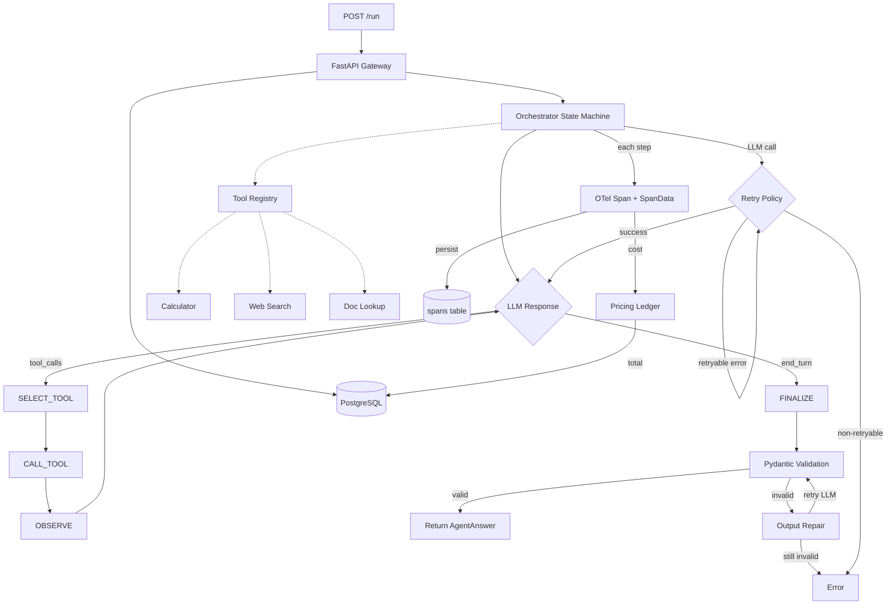

# Architecture

## Current State (Phase 3)



## Request Lifecycle

1. Client sends `POST /run` with a question
2. FastAPI creates a `runs` record in Postgres (status: running)
3. Orchestrator starts in PLAN state — sends question to GPT-4o-mini with tool schemas
4. LLM call goes through retry wrapper (exponential backoff, max 3 attempts)
5. **Each step records a SpanData**: step_type, tokens, cost, latency, timestamps
6. The model either:
   - Calls a tool → SELECT_TOOL → CALL_TOOL → OBSERVE → back to LLM
   - Returns text → FINALIZE
7. FINALIZE parses JSON from the model's text response, validates with Pydantic
   - If validation fails → structured output repair (feed error back to LLM, retry once)
   - If repair also fails → run fails
8. **Spans persisted to Postgres** — one row per step with tokens_in, tokens_out, cost_usd, latency_ms
9. **Total cost written to runs.total_cost_usd**
10. Run record updated to completed (with answer) or failed (with error)
11. Response returned to client with spans and total cost

## Orchestrator State Machine

```
PLAN ──────► SELECT_TOOL ──► CALL_TOOL ──► OBSERVE
  │                                           │
  │           ◄───────────────────────────────┘
  │           (if more tool calls)
  │
  └──► FINALIZE ──► COMPLETE
           │
           └──► OUTPUT REPAIR (1 retry) ──► COMPLETE
                                       ──► ERROR
```

States:
- **PLAN**: Initial LLM call with question + system prompt + tool schemas
- **SELECT_TOOL**: Extract tool_calls from LLM response
- **CALL_TOOL**: Execute tool(s) via BaseTool.__call__ (validates input, then executes)
- **OBSERVE**: Send tool results back to LLM
- **FINALIZE**: Parse structured JSON answer, validate with Pydantic; on failure, attempt repair
- **COMPLETE**: Valid answer produced
- **ERROR**: Unrecoverable failure

Each state handler records a **SpanData** with timing, token counts, and computed cost.

## Tracing + Cost Ledger (Phase 3)

```
Orchestrator Step
    ├── OTel Span (opentelemetry-api)
    │   └── Attributes: step_type, tokens_in, tokens_out, cost_usd, latency_ms
    └── SpanData (dataclass)
        └── Persisted to spans table in Postgres

Cost Calculation:
    cost_usd = (tokens_in × input_price_per_M / 1M) + (tokens_out × output_price_per_M / 1M)
    Uses Python Decimal for exact arithmetic

Pricing Table (src/pricing.py):
    gpt-4o-mini: $0.15/M input, $0.60/M output
    gpt-4o:      $2.50/M input, $10.00/M output
```

API endpoints:
- `GET /runs/{id}` — returns run + full trace (list of spans)
- `GET /runs/{id}/cost` — returns cost breakdown: total, per-span costs, aggregate tokens

## Tool System (Phase 2)

```
BaseTool (ABC)
├── name, description (abstract properties)
├── input_model() → Pydantic model class
├── schema() → OpenAI function schema
├── __call__(dict) → validate input, then execute
└── execute(validated_input) → str (abstract)

Implementations:
├── CalculatorTool — AST-based safe math evaluator
├── WebSearchTool — Deterministic stub with canned results
└── DocLookupTool — Keyword search over local text files
```

Tool registry in `src/tools/__init__.py` provides `build_tool_map()` — returns all tools keyed by name.

## Error Classification (Phase 2)

```
Exception
├── Retryable: APITimeoutError, RateLimitError, APIConnectionError, HTTP 5xx
│   → exponential backoff (1s, 2s, 4s), max 3 attempts
└── Non-retryable: HTTP 4xx (except 429), validation errors, bad input
    → raise immediately
```

## Data Model

```sql
runs(
    id UUID PRIMARY KEY,
    created_at TIMESTAMPTZ,
    input_question TEXT,
    final_answer JSONB,
    status TEXT,           -- pending | running | completed | failed
    total_cost_usd NUMERIC -- accumulated from span costs
)

spans(
    id UUID PRIMARY KEY,
    run_id UUID REFERENCES runs(id),
    step_index INTEGER,    -- ordering within the run
    step_type TEXT,        -- plan | tool_call | observe | finalize | repair
    tool_name TEXT,        -- NULL for non-tool steps
    input_json JSONB,
    output_json JSONB,
    tokens_in INTEGER,     -- from OpenAI response.usage
    tokens_out INTEGER,
    cost_usd NUMERIC,      -- computed via static pricing table
    cache_hit BOOLEAN,     -- always FALSE until Phase 4
    latency_ms REAL,
    started_at TIMESTAMPTZ,
    ended_at TIMESTAMPTZ
)
```

## Components (Phase 3)

| Component        | File                       | Purpose                                    |
|------------------|----------------------------|--------------------------------------------|
| API Gateway      | `src/main.py`              | FastAPI app, endpoints, span parsing       |
| Orchestrator     | `src/orchestrator.py`      | State machine, LLM interaction, retry, repair, tracing |
| Pricing          | `src/pricing.py`           | Static per-token cost calculation          |
| Base Tool        | `src/tools/base.py`        | Abstract tool contract with input validation |
| Calculator       | `src/tools/calculator.py`  | Safe math expression evaluator             |
| Web Search       | `src/tools/web_search.py`  | Deterministic stub for eval reliability    |
| Doc Lookup       | `src/tools/doc_lookup.py`  | Keyword search over local documents        |
| Tool Registry    | `src/tools/__init__.py`    | Discovers and registers all tools          |
| Error Classifier | `src/errors.py`            | Retryable vs non-retryable classification  |
| Models           | `src/models.py`            | Pydantic schemas (SpanRecord, CostBreakdown) |
| DB Layer         | `src/db.py`                | asyncpg pool, CRUD, span persistence       |
| Config           | `src/config.py`            | Environment-based settings                 |

## Planned Components (Future Phases)

- Content-hash Redis cache (Phase 4)
- Evaluation harness + graders + LLM judge (Phase 5)
- Human calibration workflow (Phase 6)
- CI regression gate (Phase 7)
