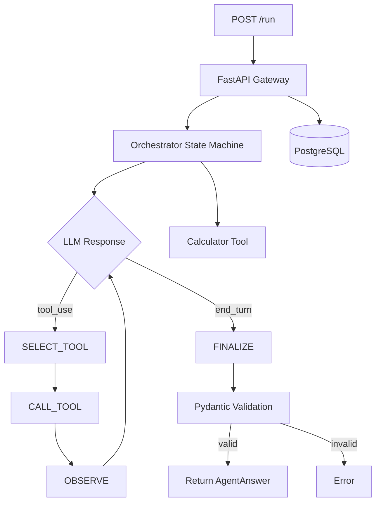

# Architecture

## Current State (Phase 1)



## Request Lifecycle

1. Client sends `POST /run` with a question
2. FastAPI creates a `runs` record in Postgres (status: running)
3. Orchestrator starts in PLAN state — sends question to Claude with tools
4. Claude either:
   - Calls a tool → SELECT_TOOL → CALL_TOOL → OBSERVE → back to LLM
   - Returns text → FINALIZE
5. FINALIZE parses JSON from Claude's text response, validates with Pydantic
6. Run record updated to completed (with answer) or failed (with error)
7. Response returned to client

## Orchestrator State Machine

```
PLAN ──────► SELECT_TOOL ──► CALL_TOOL ──► OBSERVE
  │                                           │
  │           ◄───────────────────────────────┘
  │           (if more tool calls)
  │
  └──► FINALIZE ──► COMPLETE
                ──► ERROR
```

States:
- **PLAN**: Initial LLM call with question + system prompt + tool schemas
- **SELECT_TOOL**: Extract tool_use blocks from LLM response
- **CALL_TOOL**: Execute tool(s) with validated arguments
- **OBSERVE**: Send tool results back to LLM
- **FINALIZE**: Parse structured JSON answer, validate with Pydantic
- **COMPLETE**: Valid answer produced
- **ERROR**: Unrecoverable failure

## Data Model

```sql
runs(
    id UUID PRIMARY KEY,
    created_at TIMESTAMPTZ,
    input_question TEXT,
    final_answer JSONB,
    status TEXT,           -- pending | running | completed | failed
    total_cost_usd NUMERIC
)
```

## Components (Phase 1)

| Component     | File                     | Purpose                              |
|---------------|--------------------------|--------------------------------------|
| API Gateway   | `src/main.py`            | FastAPI app, endpoints               |
| Orchestrator  | `src/orchestrator.py`    | State machine, LLM interaction       |
| Calculator    | `src/tools/calculator.py`| Safe math expression evaluator       |
| Models        | `src/models.py`          | Pydantic schemas                     |
| DB Layer      | `src/db.py`              | asyncpg connection pool, CRUD        |
| Config        | `src/config.py`          | Environment-based settings           |

## Planned Components (Future Phases)

- Tool Registry with base abstraction (Phase 2)
- Retry policy with exponential backoff (Phase 2)
- OpenTelemetry tracing + span persistence (Phase 3)
- Cost ledger with per-step accounting (Phase 3)
- Content-hash Redis cache (Phase 4)
- Evaluation harness + graders + LLM judge (Phase 5)
- Human calibration workflow (Phase 6)
- CI regression gate (Phase 7)
