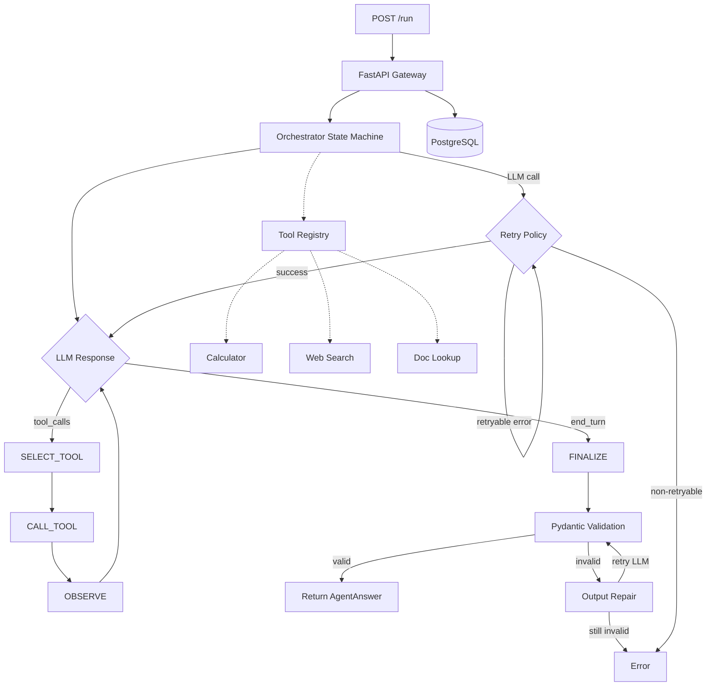

# Architecture

## Current State (Phase 2)



## Request Lifecycle

1. Client sends `POST /run` with a question
2. FastAPI creates a `runs` record in Postgres (status: running)
3. Orchestrator starts in PLAN state — sends question to GPT-4o-mini with tool schemas
4. LLM call goes through retry wrapper (exponential backoff, max 3 attempts)
5. The model either:
   - Calls a tool → SELECT_TOOL → CALL_TOOL → OBSERVE → back to LLM
   - Returns text → FINALIZE
6. FINALIZE parses JSON from the model's text response, validates with Pydantic
   - If validation fails → structured output repair (feed error back to LLM, retry once)
   - If repair also fails → run fails
7. Run record updated to completed (with answer) or failed (with error)
8. Response returned to client

## Orchestrator State Machine

```
PLAN ──────► SELECT_TOOL ──► CALL_TOOL ──► OBSERVE
  │                                           │
  │           ◄───────────────────────────────┘
  │           (if more tool calls)
  │
  └──► FINALIZE ──► COMPLETE
           │
           └──► OUTPUT REPAIR (1 retry) ──► COMPLETE
                                       ──► ERROR
```

States:
- **PLAN**: Initial LLM call with question + system prompt + tool schemas
- **SELECT_TOOL**: Extract tool_calls from LLM response
- **CALL_TOOL**: Execute tool(s) via BaseTool.__call__ (validates input, then executes)
- **OBSERVE**: Send tool results back to LLM
- **FINALIZE**: Parse structured JSON answer, validate with Pydantic; on failure, attempt repair
- **COMPLETE**: Valid answer produced
- **ERROR**: Unrecoverable failure

## Tool System (Phase 2)

```
BaseTool (ABC)
├── name, description (abstract properties)
├── input_model() → Pydantic model class
├── schema() → OpenAI function schema
├── __call__(dict) → validate input, then execute
└── execute(validated_input) → str (abstract)

Implementations:
├── CalculatorTool — AST-based safe math evaluator
├── WebSearchTool — Deterministic stub with canned results
└── DocLookupTool — Keyword search over local text files
```

Tool registry in `src/tools/__init__.py` provides `build_tool_map()` — returns all tools keyed by name.

## Error Classification (Phase 2)

```
Exception
├── Retryable: APITimeoutError, RateLimitError, APIConnectionError, HTTP 5xx
│   → exponential backoff (1s, 2s, 4s), max 3 attempts
└── Non-retryable: HTTP 4xx (except 429), validation errors, bad input
    → raise immediately
```

## Data Model

```sql
runs(
    id UUID PRIMARY KEY,
    created_at TIMESTAMPTZ,
    input_question TEXT,
    final_answer JSONB,
    status TEXT,           -- pending | running | completed | failed
    total_cost_usd NUMERIC
)
```

## Components (Phase 2)

| Component        | File                       | Purpose                                    |
|------------------|----------------------------|--------------------------------------------|
| API Gateway      | `src/main.py`              | FastAPI app, endpoints                     |
| Orchestrator     | `src/orchestrator.py`      | State machine, LLM interaction, retry, repair |
| Base Tool        | `src/tools/base.py`        | Abstract tool contract with input validation |
| Calculator       | `src/tools/calculator.py`  | Safe math expression evaluator             |
| Web Search       | `src/tools/web_search.py`  | Deterministic stub for eval reliability    |
| Doc Lookup       | `src/tools/doc_lookup.py`  | Keyword search over local documents        |
| Tool Registry    | `src/tools/__init__.py`    | Discovers and registers all tools          |
| Error Classifier | `src/errors.py`            | Retryable vs non-retryable classification  |
| Models           | `src/models.py`            | Pydantic schemas                           |
| DB Layer         | `src/db.py`                | asyncpg connection pool, CRUD              |
| Config           | `src/config.py`            | Environment-based settings                 |

## Planned Components (Future Phases)

- OpenTelemetry tracing + span persistence (Phase 3)
- Cost ledger with per-step accounting (Phase 3)
- Content-hash Redis cache (Phase 4)
- Evaluation harness + graders + LLM judge (Phase 5)
- Human calibration workflow (Phase 6)
- CI regression gate (Phase 7)
