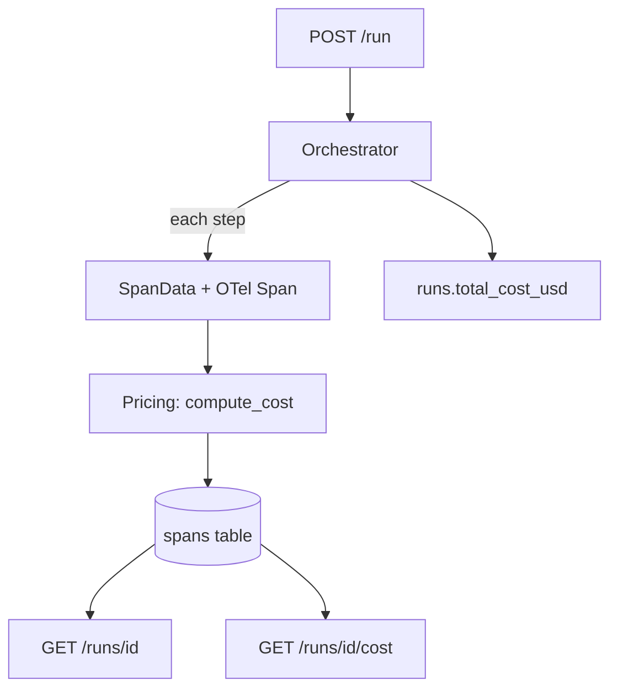

# Phase 3 Complete — Tracing + Cost Ledger

## 1. What We Built

Per-step observability for every agent run: OpenTelemetry spans, token accounting, cost calculation, and full trace persistence.

Components:
- **spans table** in Postgres — one row per orchestrator step with tokens, cost, latency, timestamps
- **Static pricing module** (`src/pricing.py`) — Decimal-based per-token cost calculation for OpenAI models
- **SpanData recording** in the orchestrator — every state handler captures timing, token counts, and cost
- **OTel span instrumentation** — opentelemetry-api spans wrap each step for distributed tracing compatibility
- **Cost persistence** — `runs.total_cost_usd` updated with accumulated per-step costs
- **Enhanced GET /runs/{id}** — returns full trace (list of spans) with the run
- **New GET /runs/{id}/cost** — cost breakdown with per-span details and aggregate token counts
- **91 passing tests** (74 existing + 17 new)

## 2. Files Changed

```
db/init.sql                 # MODIFIED — added spans table + index
src/pricing.py              # NEW — static pricing table, compute_cost()
src/models.py               # MODIFIED — SpanRecord, CostBreakdown, RunResponse updated
src/db.py                   # MODIFIED — insert_span, get_spans, update_run_cost
src/orchestrator.py         # MODIFIED — SpanData, OTel spans, token extraction, cost accumulation
src/main.py                 # MODIFIED — _parse_spans, enhanced GET /runs/{id}, new GET /runs/{id}/cost
requirements.txt            # MODIFIED — added opentelemetry-api, opentelemetry-sdk
tests/test_pricing.py       # NEW — 6 tests
tests/test_tracing.py       # NEW — 8 tests
tests/test_api.py           # MODIFIED — 3 new tests, updated mocks
```

## 3. Architecture



## 4. Key Design Decisions

1. **OTel for tracing** — industry standard, span context propagation, backend-agnostic
2. **Postgres for span storage** — API-queryable traces, SQL aggregation, no extra service
3. **Static pricing table** — no pricing API exists, Decimal arithmetic prevents rounding drift
4. **Dual recording** — OTel spans for distributed tracing compatibility, SpanData for Postgres persistence

## 5. How Token Counting Works

OpenAI's chat completion response includes `usage.prompt_tokens` and `usage.completion_tokens`. The `_extract_usage()` method pulls these from every LLM response. Tool calls have zero tokens (tools execute locally).

## 6. How Cost Calculation Works

```python
cost_usd = (tokens_in × input_price_per_M / 1,000,000) + (tokens_out × output_price_per_M / 1,000,000)
```

All arithmetic uses Python `Decimal`. The pricing table covers gpt-4o-mini ($0.15/$0.60 per M) and gpt-4o ($2.50/$10.00 per M). Unknown models return $0.

## 7. Span Types Recorded

| Step Type | Has Tokens | Has Cost | Description |
|-----------|-----------|----------|-------------|
| plan      | Yes       | Yes      | Initial LLM call |
| tool_call | No        | No       | Local tool execution |
| observe   | Yes       | Yes      | Post-tool LLM call |
| finalize  | No        | No       | JSON parsing + validation |
| repair    | Yes       | Yes      | Output repair LLM call |

## 8. Test Coverage

- **test_pricing.py** (6 tests): cost calculation for known models, unknown models, zero tokens, large counts, dated variants
- **test_tracing.py** (8 tests): span recording per step type, cost accumulation, tool spans have zero cost, null usage handling, _extract_usage
- **test_api.py** (3 new tests): spans returned in GET /runs/{id}, cost endpoint, cost 404

## 9. What This Proves (Resume Bullet 1)

> Built an orchestration layer for a multi-step LLM agent (tool-calling, retries, structured outputs) with **per-step tracing and token/cost accounting**, so every run is **inspectable** and **attributable** rather than a black box.

- "per-step tracing": Each state handler records a SpanData with timing, wrapped in an OTel span
- "token/cost accounting": Token counts from OpenAI usage, cost via static pricing with Decimal
- "inspectable": GET /runs/{id} returns the full trace
- "attributable": GET /runs/{id}/cost returns per-span cost breakdown

## 10. What's Next

Phase 4: Content-hash cache in Redis — SHA-256 of (step_type + normalized_input), cache hit skips the call at zero cost.
