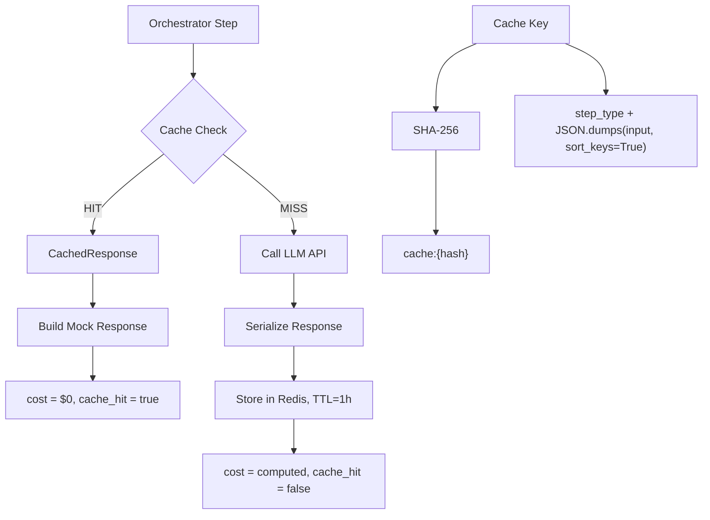

# Phase 4 Complete — Content-Hash Cache

## 1. What We Built

Content-hash caching layer using Redis: SHA-256 of (step_type + normalized_input) as the cache key. On a cache hit, the LLM call is skipped entirely — zero cost, sub-millisecond latency. On a cache miss, the result is stored with a 1-hour TTL.

Components:
- **src/cache.py** — Redis async client (init/close), SHA-256 cache key generation, get/set with TTL, graceful degradation on Redis errors
- **CachedResponse dataclass** in orchestrator — serializable representation of an LLM response (content, tool_calls, finish_reason, token counts)
- **Cache integration in _plan, _observe, _repair_output** — each LLM-calling handler checks cache before calling the API
- **_serialize_response / _build_mock_response** — convert between OpenAI response objects and cache-storable dicts
- **Verification script** (scripts/verify_cache.py) — runs same question twice, shows second run costs less
- **117 passing tests** (94 existing + 23 new)

## 2. Files Changed

```
src/cache.py                # NEW — Redis client, cache key, get/set
src/orchestrator.py         # MODIFIED — CachedResponse, cache integration in 3 handlers, serialize/mock helpers
src/main.py                 # MODIFIED — init/close Redis in lifespan
requirements.txt            # MODIFIED — added redis[hiredis]>=5.0.0
tests/test_cache.py         # NEW — 23 tests
scripts/verify_cache.py     # NEW — verification script
```

## 3. Architecture



## 4. Key Design Decisions

1. **Cache at the LLM call level, not the run level** — individual steps can be cached independently. A run that hits cache on plan but misses on observe still saves the plan call's cost.

2. **SHA-256 of step_type + normalized input** — step_type prevents cross-step collisions (same messages, different context). JSON.dumps with sort_keys=True ensures key-order-independent hashing.

3. **Graceful degradation** — if Redis is down, cache_get returns None and cache_set is a no-op. The agent continues without caching rather than failing.

4. **Mock response reconstruction** — cached data is stored as a plain dict (content, tool_calls, finish_reason, tokens). On cache hit, a mock response object is constructed so the rest of the orchestrator doesn't need to know about the cache.

5. **Cache LLM steps only** — tool calls are local and free. Caching them adds complexity for zero cost savings. Only plan, observe, and repair steps check the cache.

## 5. How Cache Key Generation Works

```python
def cache_key(step_type: str, input_data: dict) -> str:
    normalized = json.dumps(input_data, sort_keys=True, separators=(",", ":"))
    raw = f"{step_type}:{normalized}"
    return f"cache:{hashlib.sha256(raw.encode('utf-8')).hexdigest()}"
```

Properties:
- Deterministic: same input always produces the same key
- Step-type-scoped: plan vs observe with the same data get different keys
- Key-order-independent: `{"a":1,"b":2}` and `{"b":2,"a":1}` produce the same key
- Fixed-length: always 71 chars (`cache:` + 64-char hex SHA-256)

## 6. How Cache Integration Works

For each LLM-calling handler (_plan, _observe, _repair_output):

1. Compute cache key from step_type and the step's input
2. Check Redis (`cache_get`)
3. **On hit**: construct CachedResponse from cached dict, build mock response, set cost=$0 and cache_hit=True
4. **On miss**: call LLM normally, serialize the response, store in Redis with 1h TTL
5. Record cache_hit status on the SpanData

## 7. What Gets Cached

| Step Type | Cache Input | Cached |
|-----------|-------------|--------|
| plan | question text | Yes |
| observe | full messages list | Yes |
| repair | full messages list | Yes |
| tool_call | tool input | No (local, free) |
| finalize | raw text | No (JSON parsing, free) |
| select_tool | response data | No (parsing, free) |

## 8. Test Coverage

- **TestCacheKey** (6 tests): deterministic keys, step-type differentiation, key-order independence, prefix and length
- **TestCacheGetSet** (7 tests): no-pool handling, miss, roundtrip, TTL, error graceful degradation
- **TestSerializeResponse** (2 tests): text and tool-call response serialization
- **TestBuildMockResponse** (2 tests): reconstruction from CachedResponse
- **TestCacheIntegration** (6 tests): miss calls LLM and stores, hit skips LLM, hit marks span, observe cache hit, zero total cost on hit, nonzero cost on miss

## 9. What This Proves (Resume Bullet 2, partial)

> a content-hash cache cuts repeat-call cost on unchanged steps

- "content-hash": SHA-256 of step_type + normalized input
- "cache": Redis with 1-hour TTL
- "cuts repeat-call cost": cache hit → cost = $0, LLM not called
- "on unchanged steps": same step_type + same input = same cache key = hit

## 10. What's Next

Phase 5: Eval harness — versioned dataset, deterministic graders, LLM judge.
